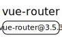
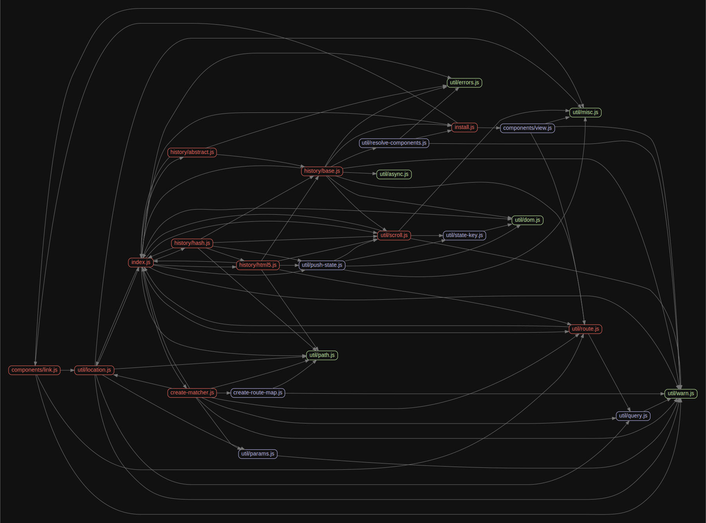

# 源码分析

## 文件结构

``` bash
/Users/liufang/openSource/FunnyLiu/vue-router
├── src
|  ├── components
|  |  ├── link.js
|  |  └── view.js
|  ├── create-matcher.js
|  ├── create-route-map.js
|  ├── history
|  |  ├── abstract.js
|  |  ├── base.js
|  |  ├── hash.js
|  |  └── html5.js
|  ├── index.js
|  ├── install.js
|  └── util
|     ├── async.js
|     ├── dom.js
|     ├── errors.js
|     ├── location.js
|     ├── misc.js
|     ├── params.js
|     ├── path.js
|     ├── push-state.js
|     ├── query.js
|     ├── resolve-components.js
|     ├── route.js
|     ├── scroll.js
|     ├── state-key.js
|     └── warn.js

```

## 外部模块依赖



## 内部模块依赖


  


## 知识点


### 初始化时做了什么？


插件注册的时候的核心逻辑：给vue组件增加$router和$route，并全局注册RouterView和RouterLink组件。

``` js
// mixin
  Vue.mixin({
    beforeCreate () {
      // $options.router存在则表示是根组件
      if (isDef(this.$options.router)) {
        this._routerRoot = this
        this._router = this.$options.router
        this._router.init(this)
        Vue.util.defineReactive(this, '_route', this._router.history.current)
      } else {
        // 不是根组件则从父组件中获取
        this._routerRoot = (this.$parent && this.$parent._routerRoot) || this
      }
      registerInstance(this, this)
    },
    destroyed () {
      registerInstance(this)
    }
  })
  //$route 是“路由信息对象”，包括 path，params，hash，query，fullPath，matched，name 等路由信息参数。
  // 而 $router 是“路由实例”对象包括了路由的跳转方法，钩子函数等。
  Object.defineProperty(Vue.prototype, '$router', {
    get () { return this._routerRoot._router }
  })

  Object.defineProperty(Vue.prototype, '$route', {
    get () { return this._routerRoot._route }
  })
  // 注册组件
  Vue.component('RouterView', View)
  Vue.component('RouterLink', Link)
```


### router-view组件做了什么？

router-view组件的作用是根据路由的变化渲染出路由所对应的组件。


``` js
// 根据路由的变化渲染出路由所对应的组件
return h(component, data, children)
```

### 路由跳转的方法实现？

以push为例，分为两种情况，hash情况下就是通过`window.location.hash = path`来实现，history情况下就是通过`history.pushState({ key: setStateKey(genStateKey()) }, '', url)` 来实现。


# vue-router [](https://circleci.com/gh/vuejs/vue-router)

> This is vue-router 3.0 which works only with Vue 2.0. For the 1.x router see the [1.0 branch](https://github.com/vuejs/vue-router/tree/1.0).

<h2 align="center">Supporting Vue Router</h2>

Vue Router is part of the Vue Ecosystem and is an MIT-licensed open source project with its ongoing development made possible entirely by the support of Sponsors. If you would like to become a sponsor, please consider:

- [Become a Sponsor on GitHub](https://github.com/sponsors/posva)
- [One-time donation via PayPal](https://paypal.me/posva)

<!--sponsors start-->

<h3 align="center">Platinum Sponsors</h3>
  <p align="center">
    <a href="https://www.finclip.com/#/home?from=vue" target="_blank" rel="noopener noreferrer">
      <picture>
        <source srcset="https://posva-sponsors.pages.dev/logos/fincliplogo_white_svg.svg" media="(prefers-color-scheme: dark)" height="96px" alt="Finogeeks" />
        
      </picture>
    </a>
  </p>

<h4 align="center">Gold Sponsors</h4>
  <p align="center">
    <a href="https://vuejobs.com/?utm_source=vuerouter&utm_campaign=sponsor" target="_blank" rel="noopener noreferrer">
      <picture>
        <source srcset="https://posva-sponsors.pages.dev/logos/vuejobs.svg" media="(prefers-color-scheme: dark)" height="72px" alt="VueJobs" />
        
      </picture>
    </a>
  </p>

<h4 align="center">Silver Sponsors</h4>
  <p align="center">
    <a href="https://www.vuemastery.com/" target="_blank" rel="noopener noreferrer">
      <picture>
        <source srcset="https://posva-sponsors.pages.dev/logos/vuemastery-dark.png" media="(prefers-color-scheme: dark)" height="42px" alt="VueMastery" />
        
      </picture>
    </a>
    <a href="https://birdeatsbug.com/?utm_source=vuerouter&utm_medium=sponsor&utm_campaign=silver" target="_blank" rel="noopener noreferrer">
      <picture>
        <source srcset="https://posva-sponsors.pages.dev/logos/birdeatsbug-light.svg" media="(prefers-color-scheme: dark)" height="42px" alt="Bird Eats Bug" />
        
      </picture>
    </a>
  </p>

<h4 align="center">Bronze Sponsors</h4>
  <p align="center">
    <a href="https://storyblok.com" target="_blank" rel="noopener noreferrer">
      <picture>
        <source srcset="https://posva-sponsors.pages.dev/logos/storyblok.png" media="(prefers-color-scheme: dark)" height="26px" alt="Storyblok" />
        
      </picture>
    </a>
    <a href="https://nuxtjs.org" target="_blank" rel="noopener noreferrer">
      <picture>
        <source srcset="https://posva-sponsors.pages.dev/logos/nuxt-dark.svg" media="(prefers-color-scheme: dark)" height="26px" alt="NuxtJS" />
        
      </picture>
    </a>
  </p>
<!--sponsors end-->

---

Get started with the [documentation](http://router.vuejs.org), or play with the [examples](https://github.com/vuejs/vue-router/tree/dev/examples) (see how to run them below).

### Development Setup

```bash
# install deps
npm install

# build dist files
npm run build

# serve examples at localhost:8080
npm run dev

# lint & run all tests
npm test

# serve docs at localhost:8080
npm run docs
```

## Releasing

- `yarn run release`
  - Ensure tests are passing `yarn run test`
  - Build dist files `VERSION=<the_version> yarn run build`
  - Build changelog `yarn run changelog`
  - Commit dist files `git add dist CHANGELOG.md && git commit -m "[build $VERSION]"`
  - Publish a new version `npm version $VERSION --message "[release] $VERSION"
  - Push tags `git push origin refs/tags/v$VERSION && git push`
  - Publish to npm `npm publish`

## Questions

For questions and support please use the [Discord chat server](https://chat.vuejs.org) or [the official forum](http://forum.vuejs.org). The issue list of this repo is **exclusively** for bug reports and feature requests.

## Issues

Please make sure to read the [Issue Reporting Checklist](https://github.com/vuejs/vue/blob/dev/.github/CONTRIBUTING.md#issue-reporting-guidelines) before opening an issue. Issues not conforming to the guidelines may be closed immediately.

## Contribution

Please make sure to read the [Contributing Guide](https://github.com/vuejs/vue/blob/dev/.github/CONTRIBUTING.md) before making a pull request.

## Changelog

Details changes for each release are documented in the [`CHANGELOG.md file`](https://github.com/vuejs/vue-router/blob/dev/CHANGELOG.md).

## Stay In Touch

- For latest releases and announcements, follow on Twitter: [@vuejs](https://twitter.com/vuejs)

## License

[MIT](http://opensource.org/licenses/MIT)

Copyright (c) 2013-present Evan You

## Special Thanks

<a href="https://www.browserstack.com">
  
</a>

Special thanks to [BrowserStack](https://www.browserstack.com) for letting the maintainers use their service to debug browser specific issues.
